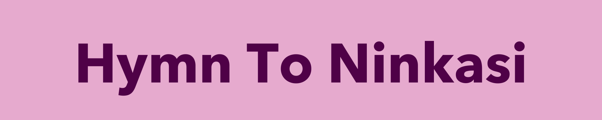

> _Borne of the flowing water,_
>
> _Tenderly cared for by the Ninhursag,_
>
> _Ninkasi, having founded your town by the sacred lake,_
>
> _She finished its great walls for you._

NinTeam è lieta di darvi il benvenuto nel repository ufficiale di **Hymn to Ninkasi**!
Questo repository contiene il codice sorgente, la documentazione e altri materiali correlati al gioco.

## ℹ️ Descrizione del Progetto

_Hymn to Ninkasi_ è un videogame creato come progetto universitario per il corso di "_Metodi Avanzati di Programmazione_" presso l'_Università degli Studi di Bari Aldo Moro_.
Nasce con il desiderio di trasportare il giocatore in una notte iconica che ha segnato la fine del secondo millennio: il 31 dicembre 1999. 

## 🎮 Funzionalità Chiave

- quattro donne e una sola notte per risolvere il mistero che lega l'amicizia tra Wine, Margarita, Martini e Gin.
- interagisci con il gioco in una modalità ibrida alternando la classica avventura testuale alla più moderna visual novel a scelte.
- rendi unica la tua esperienza scoprendo tutti i finali!

## 🛠️ Tecnologie Utilizzate

_Hymn to Ninkasi_ è stato creato grazie a:

- 💻 **Java**, con il quale è stato possibile implementare:
  - una Scoreboard per salvare il proprio tempo di gioco e interfacciarsi con il progresso di altri utenti online,
  - una OST per garantire un'esperienza immersiva al giocatore,
  - un sistema di dialoghi e di interazioni con l'ambiente per rendere il gameplay dell'utente il quanto più libero possibile,
  - un API sempre in aggiornamento con nuove domande con cui mettersi alla prova.
- 🎨 **Java Swing**: per dare forma estetica alle idee del Ninteam.

## 🔧 Installazione

Per iniziare a giocare, segui questi semplici passaggi:

1. **Clona il Repository**: Esegui `git clone https://github.com/francapali/Hymn-to-Ninkasi.git`.
2. **Installa le Dipendenze**: Esegui `npm install` per installare tutte le dipendenze necessarie.
3. **Avvia il Gioco**: Esegui `npm start` e preparati per l'avventura!

## 📞 Contatti

Per ulteriori informazioni, domande o semplicemente per condividere il tuo entusiasmo per il gioco, contattaci su:

- 📧 Email: [NinTeam99@gmail.com](mailto:ninteam99@gmail.com)
- 🌐 Sito Web: [UniBA: Dipartimento di Informatica](https://www.uniba.it/it/ricerca/dipartimenti/informatica)

Il NinTeam ti ringrazia per il tuo sostegno in questa incredibile avventura! Ti auguriamo buon divertimento con  _Hymn to Ninkasi_! 
