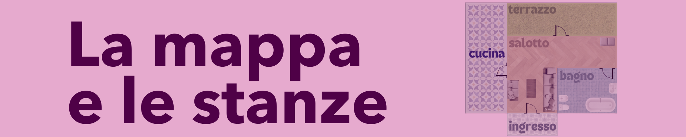
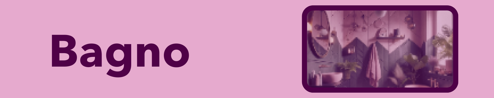
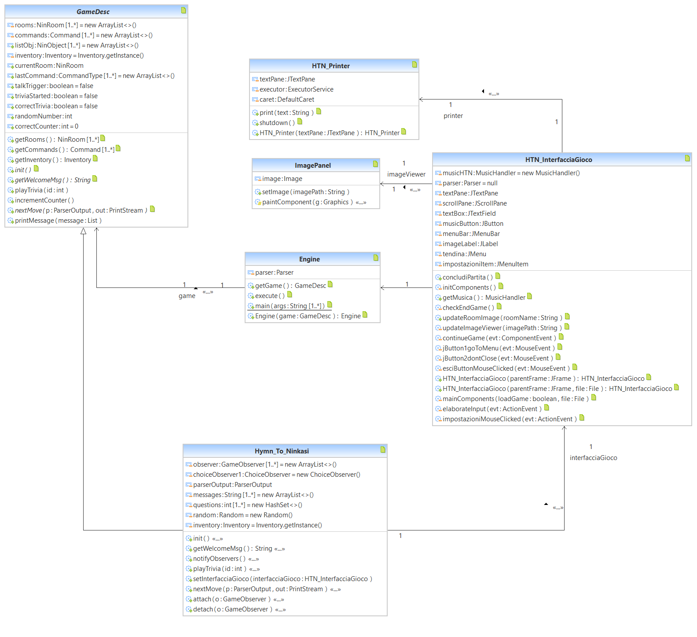
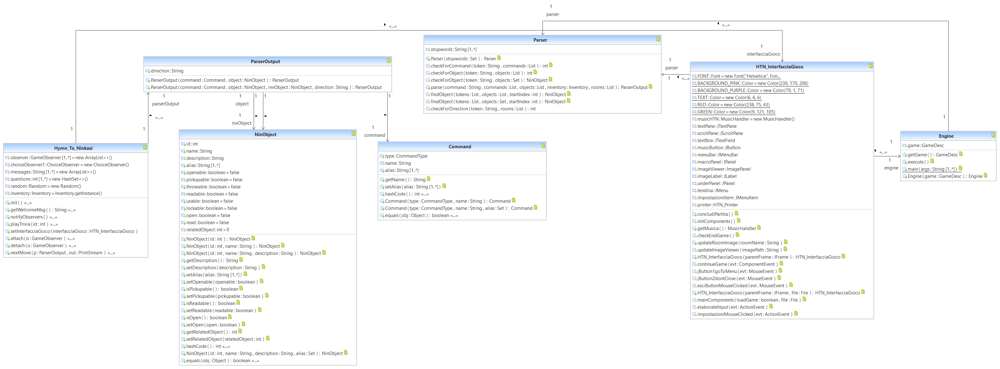
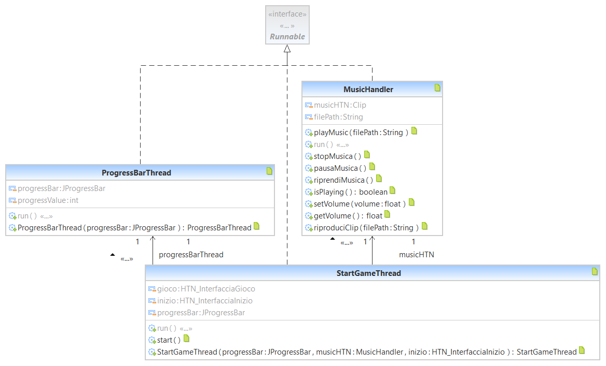
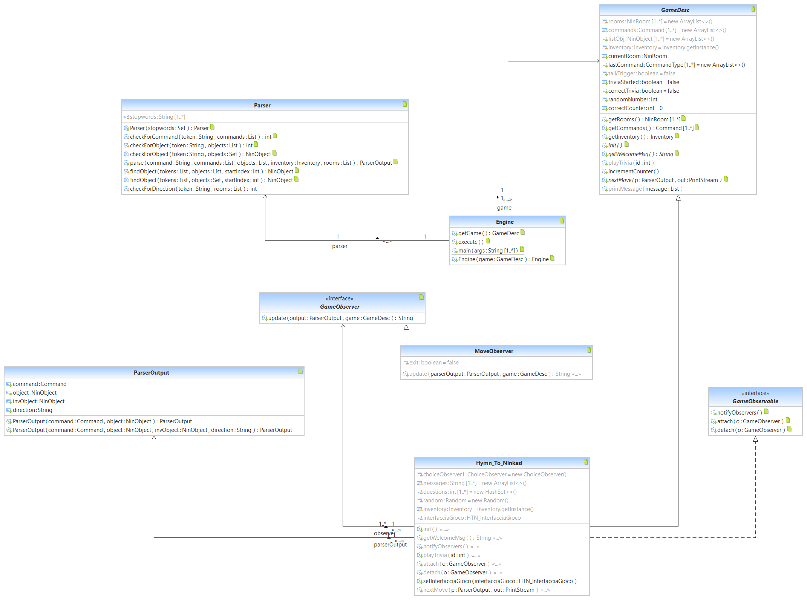

# Relazione Tecnica - Hymn To Ninkasi

1. [Introduzione](#Introduzione)
   1. [La trama](#La-trama)
   2. [I personaggi](#I-personaggi)
3. [Implementazione](#Implementazione)
4. [Diagramma delle Classi](#Diagramma-delle-Classi)
5. [Specifica algebrica](#Specifica-algebrica)
6. [Applicazione argomenti del corso](#Applicazione-argomenti-del-corso)
   1. [Parser](#Parser)
   2. [JDBC Java Database Connettivity](#JDBC-Java-DataBase-Connettivity)
   3. [Thread](#Thread)
   4. [Lambda Expressions](#Lambda-Expressions)
   5. [File](#File)
   6. [GUI](#GUI)
   7. [Programmazione in Rete](#Programmazione-in-Rete)
   8. [API](#API-Le-domande-di-Mojito)
  
## Introduzione
**Hymn To Ninkasi** è un progetto sviluppato dal NinTeam per l'esame finale del corso universitario di *Metodi Avanzati di programmazione* del Prof. Pierpaolo Basile presso il Dipartimento di Informatica dell'Università degli Studi di Bari "Aldo Moro".  
  
HTN nasce con l'idea di concretizzare i concetti appresi dalle lezioni riguardo alla Programmazione ad Oggetti realizzando un videogioco che permette all'utente di interagirvi in una modalità ibrida: alternando la classica avventura testuale alla più moderna visual novel a scelte.  
___
Il NinTeam:  
<div class="container">
  <a href="https://github.com/tondim">
    
  </a>  
  <a href="https://github.com/francapali">
    
  </a> 
  <a href="https://github.com/WilliTini">
    
  </a> 
</div>

___ 

Venerata dea sumera della birra, incarna la saggezza ancestrale e l'arte sacra della produzione di questa bevanda divina. Figlia del dio dell'acqua Enki e della dea Ninti, la sua nascita era associata alle acque primordiali che portavano vita e fertilità alla terra. Si diceva che Ninkasi fosse stata creata proprio per diffondere la conoscenza e l'arte della produzione della birra tra gli esseri umani. L'inno a Ninkasi è una celebrazione della dea e una guida alla lavorazione del luppolo.  
​
> *Borne of the flowing water,  
> Tenderly cared for by the Ninbursag,  
> Ninkasi, having founded your town by the sacred lake,  
> She finished its great walls for you*  
> -Hymn To Ninkasi
### La trama
New York, San Silvestro del 1999. Quattro donne e una sola notte per risolvere il mistero che lega l'amicizia tra Wine, Margarita, Martini e Gin. Una collana di perle, una lettera di addio, la possibilità di vivere ancora e ancora la stessa serata ma da punti di vista diversi, riscoprendo ogni volta una storia nuova, quale sarà la tua?  

[Click qui per il gameplay del gioco](https://youtu.be/hwu2v6W0jfo)
___
### I personaggi
  
Dal carattere forte e determinato, **Gin** è amica di Wine, Margarita e Martini dai tempi del college, non sono mai più state in grado di separarsi. Vive una vita agiata e privilegiata, ha trent'anni, è un'architetta specializzata in design di interni. Adorna sfoggiare le case che ristruttura da cima a fondo come se stesse mettedo in vetrina la sua migliore versione di sè. Motivo per il quale il suo nuovo loft nel cuore di New York City, fresco fresco di ristrutturazione è il luogo più adatto per ospitare la festa più attesa dell'anno.

  
**Margarita** è una donna semplice e genuina. Cuoca di successo in uno dei ristoranti italiani più in  della contea. La sua love-language non è altro che cucinare per chi ama. Sempre pronta all'avventura, è da poco tornata dall'Europa con una ventata di sapori mediterranei da far girare la testa agli invitati della padrona di casa.

  
**Martini** non ha ancora deciso cosa farà da grande, ha concluso gli studi in legge ma non è un'avvocata, amava le passerelle ma mai da intraprendere la carriera da stilista. Ma di una cosa era consapevole: non avrebbe mai scambiato la sua vita con quella di nessun altro al mondo: il lusso, le serate di gala, i suoi abiti firmati e suo padre, cui è molto legata. Ritrovare se stessi nelle lande desolate del Colorado era troppo radical chic anche per lei, e che caldo poi!


Sviluppatrice software, appassionata all'arte e al buon vino. Ama trascorrere le serate nelle case di Gin, ogni volta in attesa di un nuovo pezzo in aggiunta alla sua collezione di design. Testarda e irremovibile nelle sue scelte, desidera avere l'ultima parola su tutto. Vive in un mondo di uomini, imprigionata negli stereotipi di genere che fin troppo spesso danno il potere alla sua testa di autosabotarla. Al college le ragazze hanno rappresentato per lei un'ancora di salvezza e una fonte inesauribile d'ispirazione nella vita di tutti i giorni come esempio lampante di donne forti.
___  





___
### Implementazione
Hymn To Ninkasi è stato realizzato utilizzando il linguaggio di programmazione Java, integrato con il framework Maven per la gestione delle dipendenze e la compilazione del codice. Questa documentazione si dimostra essere fondamentale per poter garantire completezza rispetto alle implementazioni degli argomenti presentati durante il corso universitario.
___

## Diagramma delle Classi
Di seguito riportati i diagrammi delle classi per le funzionalità principali di Hymn To Ninkasi:  
1. Diagramma rappresentante la logica di gioco.
  
2. Diagramma rappresentante l'implementazione del parser.

3. Diagramma rappresentante l'implementazione della ProgressBar e del MusicHandler.

4. Diagramma rappresentante l'implementazione delle interazioni di gioco.

___

## Specifica algebrica

All'interno del progetto sono state usate diverse strutture dati per gestire diverse situazioni. Abbiamo usato diverse liste per gestire i personaggi o gli oggetti presenti in una stanza del gioco e anche in generale per tener traccia di alcuni riferimenti importanti durante lo sviluppo del gioco. Abbiamo usato un insieme per gestire l'inventario del personaggio principale giocante di Hymn To Ninkasi. Di seguito, le specifiche algebriche di queste due strutture dati.

**Struttura Dati: Insieme**
Un insieme è una struttura dati che memorizza una collezione di elementi unici senza un ordine specifico. Supporta operazioni come aggiunta, rimozione e controllo di appartenenza in tempo costante medio, grazie all'uso di una tabella hash. Gli insiemi sono utili per evitare duplicati e per operazioni matematiche come unioni, intersezioni e differenze tra collezioni di elementi.

**Specifica Sintattica**:

*tipi*: insieme, elemento, boolean, integer

("elemento" è tipo generico di dato)

*Operazioni*:
   - newSet() -> insieme, crea un nuovo insieme;
   - isEmpty(insieme) -> boolean, verifica che l'insieme non contenga elementi;
   - add(insieme, elemento) -> insieme, aggiunge un nuovo elemento all'interno dell'insieme;
   - remove(insieme, elemento) -> insieme, rimuove un elemento dall'insieme;
   - contains(insieme, elemento) -> boolean, verifica l'appartenenza di un elemento ad un dato insieme;
   - getSize(insieme) -> integer, restituisce un intero che rappresenta la dimensione dell'insieme, e cioè il numero di elementi preseneti;

*Operazioni matematiche*:
   - unione(insieme, insieme) -> insieme, 
   - differenza(insieme, insieme) -> insieme
   - intersezione(insieme, insieme) -> insieme

**Specifica Semantica**:

Costruttori: new(), add().

Osservatori: isEmpty(), remove(), contains(), getSize()

|                           | **newSet()**        | **add(s,i)**   |
|---------------------------|------------------|--------------------------------------------|
| isEmpty(s')               |   true           |            false                           |
| remove(s', i')            |   error          | if i' = i then s else add(remove(s, i'), i)|
| contains(s', i')          |   false          | if i' = i true else contains(s, i')        |
| getSize(s')               |    0             | if contains(s,i) then getSize(s) else getSize(s) + 1 |

***Operazioni*** :
```java
      isEmpty(new()) = true
      isEmpty(add(s,i)) = false
      remove(add(s,i), i') = if (i' = i) then s else add(remove(s, i'), i)
      contains(new(), i') = false 
      contains(add(s,i'), i') = if (i'= i) true else contains(s, i') 
      getSize(new()) = 0
      getSize(add(s,i)) = if contains(s,i) then getSize(s) else getSize(s) + 1
```
***Restrinzioni***
```java
      remove(newSet())= error
```

**Struttura Dati: Lista**

Una lista è una collezione ordinata di elementi che permette l'inserimento, la rimozione e l'accesso agli elementi in base alla loro posizione indicizzata. Si ha quindi la possibilità di avere un accesso diretto tramite l'uso degli indici posizionali (efficienza e altro dipenderanno dall'implementazione usata).

**Specifica Sintattica**:

*tipi*: lista, elemento, boolean, integer

("elemento" è tipo generico di dato)

   - newList() -> lista, crea una nuova lista:
   - isEmpty(lista) - > boolean, true se la lista è vuota, false altrimenti;
   - add(lista, elemento, integer) -> lista, aggiunge un nuovo elemento alla lista, specificando la posizione; 
   - remove(lista, integer) -> lista, rimuove un elemento dalla lista dato un indice;
   - contains(lista, elemento) -> boolean, verifica l'appartenenza di un elemento ad una data lista
   - getSize(lista) -> integer, restituisce la dimensione della lista;
   - getItem(lista, integer) -> elemento, restituisce un elemento dalla lista data uno un indice
   - getIndex(lista, elemento) -> integer, restituisce un indice numerico legato alla posizione di un elemento all'interno della lista.


**Specifica Semantica**:

Costruttori: newList(), add().

Osservatori: isEmpty(), remove(), contains(), getSize(), getItem(), getIndex()

(e = elemento, i = indice)

|                           | **newList()**        | **add(l, e, i)**   |
|---------------------------|------------------|--------------------------------------------|
| isEmpty(l')               |    true          |            false                           |
| remove(l', i')            |    error         | if i = i then s else add(remove(s, e, i'), i) |
| contains(l', i')          |    false         | if i'= i true else contains(s, i')         |
| getSize(l')               |    0             | if isEmpty(l) then 1 else 1 + getSize(l)   |
| getItem(l', i)            |    error         |if (i' = i) then e else getItem(l, i');     |
| getIndex(l', e)           |    error         | if (e' = e) then i else getItem(l, e');    |

***Operazioni*** :
```java
      isEmpty(newList()) = true;
      isEmpty(add(l,i)) = false;
      remove(add(l, e ,i), i') = if (i' = i) then s else add(remove(s, e, i'), i);
      contains(add(l, e, i), i') = if (i' = i) true else contains(l, i' );
      contains(newList()) = false;
      getSize(add(l, e, i)) = if isEmpty(l) then 1 else 1 + getSize(l);
      getItem(add(l, e, i), i') = if (i' = i) then e else getItem(l, i');
      getItem(newList()) = 0;
      getIndex(add(l, e, i), e') = if (e' = e) then i else getItem(l, e');
```
***Restrinzioni***
```java
      remove(newList()) = error
      getSize(newList()) = error
      getIndex(newList()) = error;
```    
___

### Parser
In un'avventura testuale, il **parser** è cruciale perché permette al gioco di comprendere e rispondere ai comandi dell'utente. Senza un parser efficace, il gioco non potrebbe interpretare correttamente le azioni dell'utente, rendendo l'interazione difficile o impossibile. Il parser analizza il testo inserito dall'utente, riconosce i comandi e gli oggetti pertinenti, e trasforma queste informazioni in istruzioni che il motore del gioco può eseguire. Questo processo rende possibile un'interazione fluida e intuitiva tra il giocatore e il gioco.  

In Hymn To Ninkasi, il parser è implementato attraverso le classi `Parser` e `ParserOutput`, insieme a un file di testo `stopwords.txt` contenente le parole da ignorare durante l'analisi.  

#### Parser.java
La classe `Parser` gestisce l'analisi dei comandi dell'utente e riconosce i comandi e gli oggetti menzionati, traducendoli in istruzioni comprensibili dal gioco.
- **Attributi**:
  - `stopwords`: Un insieme di parole da ignorare durante l'analisi.
#### Costruttore

| **Firma**                 | **Descrizione**                                              |
|---------------------------|--------------------------------------------------------------|
| `Parser(Set<String> stopwords)` | Costruttore che inizializza l'insieme delle stopwords.   |

#### Metodi

| **Firma** | **Descrizione** |
|-------------------|--------------------------------------------------------------------------------------------------------------------------------------------------------|
| `private int checkForCommand(String token, List<Command> commands)` | Verifica se un token corrisponde a un comando nell'elenco dei comandi.  |
| `private int checkForObject(String token, List<NinObject> objects)` | Verifica se un token corrisponde a un oggetto nell'elenco degli oggetti. |
| `private NinObject checkForObject(String token, Set<NinObject> objects)` | Verifica se un token corrisponde a un oggetto nell'elenco degli oggetti. |
| `public ParserOutput parse(String command, List<Command> commands, List<NinObject> objects, Inventory inventory, List<NinRoom> rooms)` | Analizza un comando dell'utente e restituisce un oggetto `ParserOutput` che rappresenta il risultato dell'analisi. |
| `private NinObject findObject(List<String> tokens, List<NinObject> objects, int startIndex)` | Trova un oggetto nella lista degli oggetti a partire da una lista di token. |
| `private NinObject findObject(List<String> tokens, Set<NinObject> objects, int startIndex)` | Trova un oggetto nel set degli oggetti a partire da una lista di token. |
| `private int checkForDirection(String token, List<NinRoom> rooms)` | Verifica se un token corrisponde a una direzione nell'elenco delle stanze. |
___
#### ParserOutput.java
La classe `ParserOutput` rappresenta l'output del parser del gioco Hymn To Ninkasi. Contiene informazioni sul comando e sugli oggetti coinvolti nel comando.

#### Attributi

| **Attributo** | **Tipo**    | **Descrizione**                                  |
|---------------|-------------|--------------------------------------------------|
| `command`     | `Command`   | Il comando identificato dal parser.              |
| `object`      | `NinObject` | L'oggetto specifico associato al comando.        |
| `invObject`   | `NinObject` | L'oggetto nell'inventario associato al comando.  |
| `direction`   | `String`    | La direzione in cui guardare con gli appositi comandi. |

#### Costruttori

| **Firma**                                         | **Descrizione**                                                                              |
|---------------------------------------------------|----------------------------------------------------------------------------------------------|
| `ParserOutput(Command command, NinObject object)` | Inizializza `ParserOutput` con solo l'oggetto specifico.                                      |
| `ParserOutput(Command command, NinObject object, NinObject invObject, String direction)` | Inizializza `ParserOutput` con l'oggetto specifico e l'oggetto nell'inventario.               |

#### Metodi

| **Firma**                                | **Descrizione**                                                      |
|------------------------------------------|----------------------------------------------------------------------|
| `Command getCommand()`                   | Restituisce il comando identificato dal parser.                      |
| `void setCommand(Command command)`       | Imposta il comando identificato dal parser.                          |
| `NinObject getObject()`                  | Restituisce l'oggetto specifico associato al comando.                |
| `void setObject(NinObject object)`       | Imposta l'oggetto specifico associato al comando.                    |
| `NinObject getInvObject()`               | Restituisce l'oggetto nell'inventario associato al comando.          |
| `void setInvObject(NinObject invObject)` | Imposta l'oggetto nell'inventario associato al comando.              |
| `String getDirection()`                  | Restituisce la direzione associata al comando.                       |
| `void setDirection(String direction)`    | Imposta la direzione associata al comando.                           |

#### stopwords.txt
Il file `stopwords.txt` contiene un elenco di parole comuni da ignorare durante l'analisi dei comandi dell'utente. Queste parole sono generalmente articoli, preposizioni e altre parole che non influenzano il significato dei comandi del gioco.
___

### JDBC Java DataBase Connettivity
Lo standard Java DataBase Connettivity (JDBC) è nato per garantire l'indipendenza della piattaforma anche per applicazioni che lavorano su basi di dati, fornendo un driver manager che gestisce con dinamicità tutti gli oggetti driver che necessitano le interrogazioni a database.  

Nel caso di Hymn To Ninkasi è stato usato il Database Engine H2 in quanto implementa nativamente il protocollo JDBC e può essere utilizzato in modo embedded senza l'installazione di un server.  

Inoltre, è stato implementato un Data Access Object (DAO), un design pattern che fornisce un'interfaccia astratta per operazioni di accesso ai dati, nascondendo i dettagli della persistenza dei dati. In questo caso, `NinObjectDAO` gestisce l'accesso e la manipolazione degli oggetti `NinObject` nel database H2.

Il DAO `NinObjectDAO` è utilizzato per:
1. **Isolare la logica di accesso ai dati**:
Fornire metodi standard per interagire con il database senza esporre i dati della persistenza.
2. **Promuovere la riusabilità del codice**:
I metodi di accesso ai dati possono essere riutilizzati in varie parti dell'applicazione senza duplicare il codice.
3. **Facilitare la manutenzione e l'aggiornamento**: 
Le modifiche alla logica di accesso ai dati possono essere fatte in un unico punto senza impattare il resto dell'applicazione.
4. **Supportare il testing**:
Permette di creare mock o stub per i test unitari, isolando la logica di business dalla logica di accesso ai dati.

Con questa struttura si può facilmente espandere `NinObjectDAO` per includere altri metodi di accesso ai dati come aggiornamenti, cancellazioni e recuperi di insiemi di dati.
___
#### **NinCharactersTable**
|  Attributo  |  Descrizione attributo                       |  Tipo                  |  Esempio      |
|:----:|:----:|:----:|:----:|
|  id         |  codice identificativo unico del personaggio |INT PRIMARY KEY NOT NULL|  `2`          |
|  name       |  nome del personaggio                        |  VARCHAR(50)           |  `martini`  |
|  bio        |  breve descrizione del personaggio           |  TEXT                  |  `Martini non ha ancora deciso cosa farà da grande, ha concluso gli studi in legge ma non è un''avvocata, amava le passerelle ma mai da intraprendere la carriera da stilista. Di una cosa era consapevole: non avrebbe mai scambiato la sua vita con quella di nessun altro al mondo: il lusso, le serate di gala, i suoi abiti firmati e suo padre, cui è molto legata. Ritrovare se stessi nelle lande desolate del Colorado era troppo radical chic anche per lei, e che caldo poi!`        |
___
#### **NinObjectTable**
|  Attributo       |  Descrizione attributo                                           |  Tipo                  |  Esempio  |
|:----:|:----:|:----:|:----:|
|  id              |  codice identificativo unico dell'oggetto                        |INT PRIMARY KEY NOT NULL|   `13`    |
|  name            |  nome dell'oggetto                                               |  VARCHAR(255) NOT NULL |   `chiave del bagno`         |
|  description     |  descrizione dell'oggetto                                        |  TEXT                  |   `Una chiave universale che permette di aprire dall''esterno la porta del bagno. È impreziosita da un portachiavi con un pompon rosa.`             |
|  alias           |  insieme di termini con il quale ci si può riferire all'oggetto  |  VARCHAR(255)          |  `chiave` |
|  pickupable      |  definisce se un oggetto può essere raccolto                     |  BOOLEAN DEFAULT TRUE  |  `TRUE`   |
|  throwable       |  definisce se un oggetto può essere rilasciato                   |  BOOLEAN DEFAULT TRUE  |  `TRUE`   |
|  readable        |  definisce se un oggetto può essere letto                        |  BOOLEAN DEFAULT FALSE |  `FALSE`  |
|  usable          |  definisce se un oggetto può essere usato                        |  BOOLEAN DEFAULT FALSE |  `TRUE`   |
|  openable        |  definisce se un oggetto può essere aperto                       |  BOOLEAN DEFAULT FALSE |  `FALSE`  |
|  lockable        |  definisce se un oggetto può essere chiuso                       |  BOOLEAN DEFAULT FALSE |  `FALSE`  |
|  open            |  definisce se un oggetto è aperto                                |  BOOLEAN DEFAULT FALSE |  `FALSE`  |
|  read            |  definisce se un oggetto è stato letto                           |  BOOLEAN DEFAULT FALSE |  `FALSE`  |
|  relatedObjects  |  codice identificativo di un eventuale oggetto correlato         |  INT                   |  `5`      |

 ___
#### **NinRoomTable**
|  Attributo       |  Descrizione attributo                                           |  Tipo                  |  Esempio  |
|:----:|:----:|:----:|:----:|
|  id              |  codice identificativo unico della stanza                        |INT PRIMARY KEY NOT NULL|   `51`    |
|  name            |  nome della stanza                                               |  VARCHAR(255) NOT NULL | `salotto` |
|  description     |  descrizione della stanza                                        |  TEXT          |   `Ecco a te una stanza moderna e accogliente. Il pavimento è rivestito con un elegante parquet chiaro, che riflette la luce calda delle lampade a sospensione in stile industriale. Il centro del salotto è dominato da un ampio divano ad angolo in velluto grigio, circondato da una serie di tavolini bassi in vetro e metallo. Alle pareti, mensole eleganti ospitano libri e oggetti decorativi, mentre un grande tappeto geometrico aggiunge un tocco di colore e comfort. Si respira un clima vivace e festoso, con musica e risate che riempiono la stanza, e diversi ospiti intenti a formare coppie per una partita di beer-pong.`             |
|  north           |  codice stanza cui è possibile accedere verso nord  |  INT  |  `50` |
|  look_North      |  descrizione della zona nord della stanza           |  VARCHAR(300) |  `Alle tue spalle, grandi finestre a tutta parete, dotate di tende leggere, si affacciano a nord sul terrazzo, creando un collegamento visivo con l''esterno.`   |
|  south           |  codice stanza cui è possibile accedere verso sud   |  INT   |  `54` |
|  look_South      |  descrizione della zona sud della stanza            |  VARCHAR(300)  |  `Davanti a te, l''ingresso principale del loft accoglie gli ospiti con un piccolo corridoio ornato da alcune delle fotografie di viaggio di Gin, incorniciate con gusto.`  |
|  east            |  codice stanza cui è possibile accedere verso est   |  INT  |  `53`  |
|  look_East       |  descrizione della zona est della stanza            |  VARCHAR(300)  |  `Sulla tua destra vedi una imponente porta bianca, dallo stile discutibile per un bagno dal momento che è adornata da un pomello rosa.`  |
|  west            |  codice stanza cui è possibile accedere verso ovest |  INT  |  `52`  |
|  look_West       |  descrizione della zona ovest della stanza          |  VARCHAR(300)  |  `Sulla tua sinistra si trova un passaggio che dà accesso alla cucina, da cui proviene un irresistibile profumo di stuzzichini preparati per la festa.`  |
___
#### **NinDialogueTable**
|  Attributo     |  Descrizione attributo                      |  Tipo                  |  Esempio  |
|:----:|:----:|:----:|:----:|
|  id            |  codice univoco dell'interazione            |INT PRIMARY KEY NOT NULL|  `101`                           |
|  title         |  titolo dell'interazione                    |  VARCHAR(50)           |  `Margarita`                     |
|  text          |  testo dell'interazione                     |  TEXT                  |  `"Come siamo polemiche stasera! Spero tu non stia rispondendo così a casa del tuo battibecco con Martini! Sai benissimo quel che penso su quel tubino bianco! Ti stava una favola!"`                                 |
|  choice1       |  testo della prima scelta                   |  VARCHAR(150)          |  `Non riusciva a chiudersi la zip! Avrei finito con il rovinarlo!`                           |
|  choice2       |  testo della seconda scelta                 |  VARCHAR(150)          |  `Martini sognava di abbinarci quel collier, non potevo farle questo!`                        |
|  User_choice1  |  riconduce all'interazione con la scelta 1  |  INT                   |  `102`  |
|  user_choice2  |  riconduce all'interazione con la scelta 2  |  INT                   |  `103`  |

[File per il popolamento del database](./hymn_to_ninkasi/resources/populate_database.sql)  
___

### Thread
Un **thread** rappresenta un flusso di esecuzione all'interno di un programma, cioè un processo che può operare in modo indipendente dagli altri processi. In Java, i thread sono utilizzati per eseguire operazioni simultaneamente, consentendo di ottimizzare l'utilizzo delle risorse di sistema e migliorare le prestazioni delle applicazioni.

In Java, la gestione dei thread è supportata principalmente attraverso la classe `Thread`, che implementa tutte le funzionalità di un singolo thread. Esistono due approcci principali per creare un thread:

1. **Estendere** la classe `Thread`, il che richiede l'implementazione del metodo `run()`, contenente il codice eseguito dal thread.
2. **Implementare** l'interfaccia `Runnable`, che definisce il metodo `run()`, anch'esso contenente il codice eseguito dal thread.

Indipendentemente dal metodo utilizzato, per avviare l'esecuzione di un thread è necessario chiamare il metodo `start()`, il quale avvia il thread e invoca il metodo `run()`.

Un thread può essere interrotto chiamando il metodo `interrupt()`, il quale invia un segnale di interruzione al thread. Questo segnale può essere catturato e gestito all'interno del metodo `run()`.

Inoltre, esiste il metodo `join()`, che permette ad un thread di attendere che un altro thread completi la sua esecuzione prima di procedere.

| Classe             | Descrizione                                                                                       | Metodi                                                                                                                                                                                                                                                      |
|--------------------|---------------------------------------------------------------------------------------------------|-------------------------------------------------------------------------------------------------------------------------------------------------------------------------------------------------------------------------------------------------------------|
| `MusicHandler`     | Gestisce la colonna sonora di sottofondo di "Hymn To Ninkasi".                                     | - `playMusic(String filePath)`: Avvia la riproduzione della traccia audio specificata.<br> - `run()`: Esegue la riproduzione della traccia audio in un thread separato.<br> - `stopMusica()`: Ferma la riproduzione della traccia audio e chiude la risorsa audio.<br> - `pausaMusica()`: Mette in pausa la riproduzione della traccia audio.<br> - `riprendiMusica()`: Riprende la riproduzione della traccia audio se è stata messa in pausa.<br> - `isPlaying()`: Verifica se la traccia audio è attualmente in riproduzione.<br> - `setVolume(float volume)`: Imposta il volume della traccia audio.<br> - `getVolume()`: Ottiene il volume corrente della traccia audio.<br> - `riproduciClip(String filePath)`: Riproduce una breve clip audio una volta. |
| `ProgressBarThread`| Gestisce l'aggiornamento di una `JProgressBar` in un thread separato.                              | - `ProgressBarThread(JProgressBar progressBar)`: Costruttore per inizializzare una nuova istanza di `ProgressBarThread`.<br> - `run()`: Esegue l'aggiornamento della `JProgressBar`.                                                                                                               |
| `StartGameThread`  | Avvia il gioco "Hymn To Ninkasi" e gestisce l'interfaccia utente iniziale e la musica di sottofondo.| - `StartGameThread(JProgressBar progressBar, MusicHandler musicHTN, HTN_InterfacciaInizio inizio)`: Costruttore per inizializzare una nuova istanza di `StartGameThread`.<br> - `run()`: Avvia il thread di gioco.<br> - `start()`: Metodo helper per avviare il gioco.                        |
| `HTN_Printer`      | Gestisce la stampa animata di testo all'interno di un `JTextPane`.                                 | - `HTN_Printer(JTextPane textPane)`: Costruttore che inizializza il `JTextPane` e l'`ExecutorService`.<br> - `print(String text)`: Stampa il testo nel `JTextPane` con un effetto di digitazione.<br> - `shutdown()`: Arresta immediatamente l'`ExecutorService` e tutti i compiti in esecuzione.|

___

### Lambda Expressions

Le espressioni lambda sono una caratteristica introdotta in Java 8 che consente di scrivere codice più conciso e leggibile, introducendo un paradigma di programmazione funzionale. Questo approccio promuove l'immutabilità, creando nuovi stati a partire da quelli esistenti senza modificarli direttamente.

Le espressioni lambda sono particolarmente utili quando si devono passare funzioni come parametri a metodi, migliorando la modularità e la manutenibilità del codice. La sintassi delle espressioni lambda è composta da:

- Una lista di parametri separati da virgole e racchiusi tra parentesi tonde.
- Il token `->` che separa i parametri dal corpo della lambda.
- Un corpo che può contenere una singola espressione o un blocco di istruzioni racchiuso tra parentesi graffe `{}`.

Le espressioni lambda migliorano la chiarezza e la concisione del codice, facilitando l'implementazione di pattern di programmazione funzionale come map-reduce, filtraggio, e altre operazioni su collezioni di dati.

#### Utilizzo delle Lambda in `ChoiceObserver.java`

Nel contesto di `ChoiceObserver.java`, le espressioni lambda sono utilizzate con `IntStream` della libreria `java.util.stream` per gestire alcune interazioni all'interno della gestione dei grafi dedicati ai dialoghi, permettendo di marcare uno o più nodi alla volta.

#### Esempio in `ChoiceObserver.java`
Marca i nodi dal 4 al 5 come veri, utilizzando un flusso di interi per semplificare il processo.

```java
import java.util.stream.IntStream;

public class ChoiceObserver implements GameObserver {
    @Override
    public String update(ParserOutput parserOutput, GameDesc game) {
        // Codice omesso per brevità

        if (game.getCurrentRoom().getCharacters().get(0).getName().equals("martini")) {
            if (parserOutput.getCommand().getType() == CommandType.DUE) {
                IntStream.range(4, 5).forEach(i -> game.getCurrentRoom().getCharacters().get(0).getDialogue().get(0).getNode(i).setMarked(true));
                msg.append(game.getCurrentRoom().getCharacters().get(0).getDialogue().get(0).getNode(6).getNpcDialogue() + "\n\n");
                msg.append("1." + game.getCurrentRoom().getCharacters().get(0).getDialogue().get(0).getNode(6).getC1() + "\n");
                msg.append("2." + game.getCurrentRoom().getCharacters().get(0).getDialogue().get(0).getNode(6).getC2());
            }
        }

        return msg.toString();
    }
}
```
#### Utilizzo delle lambda in `HTN_Printer.java`
Nel contesto di `HTN_Printer.java`, le espressioni lambda sono utilizzate per eseguire aggiornamenti del documento Swing in un thread separato, migliorando la responsività dell'interfaccia utente.  
```java
import javax.swing.*;
import javax.swing.text.DefaultCaret;
import java.util.concurrent.ExecutorService;
import java.util.concurrent.Executors;
import javax.swing.text.StyledDocument;

public class HTN_Printer {
    private final JTextPane textPane;
    private final ExecutorService executor;
    private final DefaultCaret caret;

    public HTN_Printer(JTextPane textPane) {
        this.textPane = textPane;
        this.executor = Executors.newSingleThreadExecutor();
        this.caret = (DefaultCaret) textPane.getCaret();
    }

    public void print(String text) {
        executor.submit(() -> {
            try {
                caret.setUpdatePolicy(DefaultCaret.NEVER_UPDATE);
                StyledDocument doc = textPane.getStyledDocument();

                for (char c : text.toCharArray()) {
                    SwingUtilities.invokeLater(() -> {
                        try {
                            doc.insertString(doc.getLength(), String.valueOf(c), null);
                        } catch (Exception e) {
                            e.printStackTrace();
                        }
                    });
                    Thread.sleep(33);
                }

                SwingUtilities.invokeLater(() -> {
                    caret.setUpdatePolicy(DefaultCaret.ALWAYS_UPDATE);
                    textPane.setCaretPosition(doc.getLength());
                });
            } catch (InterruptedException e) {
                Thread.currentThread().interrupt();
            }
        });
    }

    public void shutdown() {
        executor.shutdownNow();
    }
}
```
___

### File
Un **file** costituisce un flusso di input/output (I/O) utilizzabile sia come origine che come destinazione di dati. In Java, la gestione dei file avviene attraverso la classe `File`, la quale offre metodi per la creazione, l'eliminazione, la lettura, la scrittura e la gestione generale dei flussi di I/O nel sistema operativo.

Gli stream possono rappresentare una varietà di entità, inclusi file su disco, dispositivi, altri programmi e array in memoria. Essi supportano diversi tipi di dati, quali byte grezzi, tipi primitivi, caratteri e oggetti. Alcuni stream semplicemente trasmettono dati senza modifiche, mentre altri eseguono manipolazioni e trasformazioni sui dati. Nonostante le differenze interne nella loro implementazione, tutti gli stream condividono un modello fondamentale: una sequenza di dati.

#### Struttura del Progetto

Il progetto **Hymn to Ninkasi** utilizza vari file per configurazioni, esecuzioni di script SQL, gestione dell'engine di gioco e servizi RESTful. Di seguito sono riportati alcuni dei file principali e le loro funzioni:

1. **DatabaseConfig.java**
   - **Posizione:** `ninteam_map_b.hymn_to_ninkasi.config`
   - **Descrizione:** Questa classe gestisce la configurazione del database H2 per il gioco, inclusa la creazione delle tabelle necessarie e il popolamento iniziale del database.

2. **Engine.java**
   - **Posizione:** `ninteam_map_b.hymn_to_ninkasi`
   - **Descrizione:** L'engine di gioco, responsabile dell'avvio del gioco, della gestione dei comandi degli utenti e dell'interazione con il gioco.

3. **ScoreService.java**
   - **Posizione:** `ninteam_map_b.hymn_to_ninkasi.restful.scoreboard`
   - **Descrizione:** Servizio RESTful per la gestione dei punteggi dei giocatori, inclusi metodi per ottenere e salvare i punteggi.

#### Dettaglio dei File

**DatabaseConfig.java**

```java
package ninteam_map_b.hymn_to_ninkasi.config;

import java.sql.Connection;
import java.sql.DriverManager;
import java.sql.SQLException;
import java.sql.Statement;
import org.h2.tools.RunScript;
import java.io.FileReader;
import java.io.IOException;

public class DatabaseConfig {
    private static final String JDBC_URL = "jdbc:h2:./resources/db";
    private static final String JDBC_USER = "NinTeam";
    private static final String JDBC_PASSWORD = "NinTeam2024";
    private static final String SQL_SCRIPT_PATH = "./resources/populate_database.sql"; // Percorso del file SQL

    public static Connection getConnection() throws SQLException {
        return DriverManager.getConnection(JDBC_URL, JDBC_USER, JDBC_PASSWORD);
    }

    public static void initializeDatabase() {
        try (Connection conn = getConnection(); Statement stmt = conn.createStatement()) {
            stmt.execute("DROP TABLE IF EXISTS NinObjectTable");
            stmt.execute("CREATE TABLE IF NOT EXISTS NinObjectTable ("
                    + "id INT PRIMARY KEY,"
                    + "name VARCHAR(255) NOT NULL, "
                    + "description TEXT, "
                    + "alias VARCHAR(255), "
                    + "pickupable BOOLEAN DEFAULT TRUE, "
                    + "throwable BOOLEAN DEFAULT TRUE, "
                    + "readable BOOLEAN DEFAULT FALSE, "
                    + "usable BOOLEAN DEFAULT FALSE, "
                    + "openable BOOLEAN DEFAULT FALSE,"
                    + "lockable BOOLEAN DEFAULT FALSE,"
                    + "open BOOLEAN DEFAULT FALSE, "
                    + "read BOOLEAN DEFAULT FALSE, "
                    + "relatedObjects INT);");
            
            stmt.execute("DROP TABLE IF EXISTS NinRoomTable");
            stmt.execute("CREATE TABLE IF NOT EXISTS NinRoomTable (" 
                    + " id INT PRIMARY KEY NOT NULL,"
                    + " name VARCHAR(255) NOT NULL,"
                    + " description TEXT,"
                    + " north INT,"
                    + " look_north VARCHAR(300),"
                    + " south INT,"
                    + " look_south VARCHAR(300),"
                    + " east INT,"
                    + " look_east VARCHAR(300),"
                    + " west INT,"
                    + " look_west VARCHAR(300));");
            
            stmt.execute("DROP TABLE IF EXISTS NinDialogueTable");
            stmt.execute("CREATE TABLE IF NOT EXISTS NinDialogueTable ("
                    + " id INT PRIMARY KEY NOT NULL,"
                    + " title VARCHAR(50),"
                    + " text TEXT,"
                    + " choice1 VARCHAR (150),"
                    + " choice2 VARCHAR (150),"
                    + " user_choice1 INT,"
                    + " user_choice2 INT);");
            
            stmt.execute("DROP TABLE IF EXISTS NinCharactersTable");
            stmt.execute("CREATE TABLE IF NOT EXISTS NinCharactersTable ("
                    + " id INT PRIMARY KEY NOT NULL,"
                    + " name VARCHAR(50),"
                    + " bio TEXT);");

        } catch (SQLException e) {
            e.printStackTrace();
        }
    }

    public static void populateDatabase() {
        try (Connection conn = getConnection()) {
            System.out.println("Avviso: Connessione al database completata.");
            RunScript.execute(conn, new FileReader(SQL_SCRIPT_PATH));
            System.out.println("Avviso: Script eseguito.");
        } catch (SQLException | IOException e) {
            e.printStackTrace();
        }
    }
}
```

**Engine.java**

```java
package ninteam_map_b.hymn_to_ninkasi;

import java.io.File;
import java.io.IOException;
import java.util.Scanner;
import java.util.Set;
import ninteam_map_b.hymn_to_ninkasi.hymntoninkasi.GameDesc;
import ninteam_map_b.hymn_to_ninkasi.parser.Parser;
import ninteam_map_b.hymn_to_ninkasi.parser.ParserOutput;
import ninteam_map_b.hymn_to_ninkasi.type.CommandType;
import ninteam_map_b.hymn_to_ninkasi.type.Utils;

public class Engine {

    private final GameDesc game;
    private Parser parser;

    public Engine(GameDesc game) {
        this.game = game;
        try {
            this.game.init();
        } catch (Exception ex) {
            System.out.println(ex);
        }
        try {
            Set<String> stopwords = Utils.loadFileListInSet(new File("./resources/stopwords.txt"));
            parser = new Parser(stopwords);
        } catch (IOException ex) {
            System.out.println(ex);
        }
    }

    public GameDesc getGame() {
        return game;
    }

    public void execute() {
        Scanner scanner = new Scanner(System.in);
        while (scanner.hasNextLine()) {
            String command = scanner.nextLine();
            ParserOutput p = parser.parse(command, game.getCommands(), game.getListObj(), game.getInventory(), game.getRooms());
            if (p == null || p.getCommand() == null) {
                System.out.println("Non capisco cosa vuoi...parla potabile");
            } else if (p.getCommand() != null && p.getCommand().getType() == CommandType.END) {
                System.out.println("Vedo palle?!?!?!");
                break;
            } else {
                game.nextMove(p, System.out);
                if (game.getCurrentRoom() == null) {
                    System.out.println("La festa finisce qui, meglio tornare a casa");
                    System.exit(0);
                }
            }
            System.out.println("-> ");
        }
    }

    public static void main (String[] args) {
        Engine engine = new Engine(new Hymn_To_Ninkasi());
        engine.execute();
    }
}
```

**ScoreService.java**

```java
package ninteam_map_b.hymn_to_ninkasi.restful.scoreboard;

import com.google.gson.Gson;
import java.io.File;
import java.io.IOException;
import java.io.RandomAccessFile;
import javax.ws.rs.Consumes;
import javax.ws.rs.GET;
import javax.ws.rs.PUT;
import javax.ws.rs.Path;
import javax.ws.rs.PathParam;
import javax.ws.rs.Produces;
import javax.ws.rs.core.MediaType;
import javax.ws.rs.core.Response;
import ninteam_map_b.hymn_to_ninkasi.type.Scoreboard;

@Path("score")
public class ScoreService {

    String filePath = "src\\scoreboard.dat";
    File file = new File(filePath);

    private void createFile() {
        try (RandomAccessFile file = new RandomAccessFile(filePath, "rw")) {
            System.out.println("Entries iniziali create con successo.");
        } catch (IOException e) {
            System.err.println("Errore nella creazione delle entry: " + e.getMessage());
        }
    }

    @GET
    @Path("/{scoreid}")
    @Produces("application/json")
    public Response score(@PathParam("scoreid") String scoreid) {

        if (!file.exists()) {
            createFile();
        }

        try (RandomAccessFile file = new RandomAccessFile(filePath, "r")) {
            boolean found = false;
            int newid = Integer.parseInt(scoreid);
            Scoreboard score;

            while (file.getFilePointer() < file.length()) {
                int id = file.readInt();
                String name = file.readUTF();
                String timeSpent = file.readUTF();
                String date = file.readUTF();

                if (id == newid) {
                    found = true;
                    score = new Scoreboard(newid, name, timeSpent, date);

                    Gson gson = new Gson();

                    String jsonString = gson.toJson(score);
                    return Response.ok(jsonString, MediaType.APPLICATION_JSON).build();
                }
            }
            if (!found) {
                return Response.status(Response.Status.NOT_FOUND).entity("Score not

 found").build();
            }

        } catch (IOException e) {
            e.printStackTrace();
            return Response.status(Response.Status.INTERNAL_SERVER_ERROR).build();
        } catch (NumberFormatException e) {
            System.out.println("Errore nel parsing dell'ID.");
            e.printStackTrace();
            return Response.status(Response.Status.BAD_REQUEST).entity("Invalid score ID").build();
        }
        return Response.status(Response.Status.INTERNAL_SERVER_ERROR).build();
    }

    @PUT
    @Path("/new")
    @Consumes(MediaType.APPLICATION_JSON)
    @Produces(MediaType.APPLICATION_JSON)
    public Response putScore(String json) {

        if (!file.exists()) {
            createFile();
        }

        Gson gson = new Gson();
        try (RandomAccessFile file = new RandomAccessFile(filePath, "rw")) {
            Scoreboard score = gson.fromJson(json, Scoreboard.class);
            score.setDate(java.time.LocalDate.now().toString());

            System.out.println("");
            System.out.println(score.getName() + score.getDate() + score.getTimeSpent());
            System.out.println("");

            int id = 0;

            while (file.getFilePointer() < file.length()) {
                id = file.readInt();
                file.readUTF();
                file.readUTF();
                file.readUTF();
            }
            file.seek(file.length());
            file.writeInt(id + 1);
            file.writeUTF(score.getName());
            file.writeUTF(score.getTimeSpent());
            file.writeUTF(score.getDate());
            String jsonString = gson.toJson(score);
            return Response.ok(jsonString, MediaType.APPLICATION_JSON).build();

        } catch (IOException e) {
            e.printStackTrace();
            return Response.status(Response.Status.INTERNAL_SERVER_ERROR).entity("Error writing to file").build();
        } catch (Exception e) {
            e.printStackTrace();
            return Response.status(Response.Status.BAD_REQUEST).entity("Invalid data").build();
        }
    }
}
```
___


### GUI
Il **package ui** contiene le classi responsabili della gestione delle varie interfacce utente del gioco "Hymn To Ninkasi". Ogni classe è progettata per gestire una specifica parte dell'interfaccia, garantendo un'esperienza di gioco fluida e coinvolgente.
#### Descrizione delle Classi nel Package `ui`

| Classe                     | Descrizione                                                                                                      | Componenti Principali                                                                                                                                                                                                                                                                                                                                                                                                                                                        |
|----------------------------|-------------------------|-------------------------------------------------------------------------------------------------------------------------------------------------------------------------------------------------------------------------------------------------------------------------------------------------------------------------------------------------------------------------------------------------------------------------------------------------------------------------------|
| **HTN_InterfacciaEnding**  | Gestisce l'interfaccia di fine gioco, permettendo al giocatore di inserire il proprio nickname e visualizzare un'immagine di fine partita. | - `JFrame parentFrame`: Frame genitore dell'interfaccia di fine gioco. <br> - `JTextField nameField`: Campo di testo per l'inserimento del nickname. <br> - `MusicHandler musicHTN`: Gestore della musica di sottofondo.                                                                                                                                                                                                                                                         |
| **HTN_InterfacciaGioco**   | Gestisce l'interfaccia principale del gioco dove avviene la maggior parte delle interazioni del giocatore.        | - `JFrame parentFrame`: Frame genitore dell'interfaccia di gioco. <br> - `JTextPane textPane`: Pannello di testo per la visualizzazione della storia e dei comandi. <br> - `JTextField textBox`: Campo di testo per l'inserimento dei comandi da parte del giocatore. <br> - `MusicHandler musicHTN`: Gestore della musica di sottofondo. <br> - `Parser parser`: Parser per l'interpretazione dei comandi del giocatore. <br> - `Engine engine`: Motore di gioco. |
| **HTN_InterfacciaInizio**  | Gestisce l'interfaccia di inizio gioco.                                                                          | - `Color BACKGROUND`: Colore di sfondo dell'interfaccia. <br> - `Color TEXT`: Colore del testo. <br> - `MusicHandler musicHTN`: Gestore della musica di sottofondo. <br> - `JProgressBar progressBar`: Barra di progresso per il caricamento del gioco. <br> - `Thread serverThread`: Thread per l'avvio del server REST. <br> - `boolean serverOn`: Stato del server REST. <br> - `JFileChooser fileChooser`: Selettore di file per il caricamento del salvataggio.               |
| **HTN_InterfacciaScoreboard** | Gestisce l'interfaccia della classifica.                                                                      | - `Color BACKGROUND`: Colore di sfondo dell'interfaccia. <br> - `Color BACKGROUND_BLACK`: Colore di sfondo scuro. <br> - `Color TEXT`: Colore del testo. <br> - `Color WHITE`: Colore bianco per la griglia della tabella. <br> - `String[] column`: Colonne della tabella ("Nome Giocatore", "Tempo", "Data"). <br> - `String[][] scores`: Dati della classifica. <br> - `JTable scoreboard`: Tabella per visualizzare la classifica. <br> - `DefaultTableModel nonEditableModel`: Modello di tabella non editabile. |
| **HTN_InterfacciaSettings** | Gestisce l'interfaccia delle impostazioni di gioco.                                                             | - `Color BLACK`: Colore di sfondo nero. <br> - `Color WHITE`: Colore bianco. <br> - `Color BACKGROUND_PINK`: Colore di sfondo rosa. <br> - `Color TEXT`: Colore del testo. <br> - `Color RED`: Colore rosso per il pulsante di mute. <br> - `Color GREEN`: Colore verde per il pulsante di play. <br> - `JFrame parentFrame`: Frame principale dell'applicazione. <br> - `JButton musicButton`: Pulsante per gestire la musica. <br> - `JLabel labVolume`: Etichetta per il volume. <br> - `JButton volumeUp`: Pulsante per aumentare il volume. <br> - `JButton volumeDown`: Pulsante per diminuire il volume. |

___

### Programmazione in Rete

Per la programmazione in rete, il NinTeam ha optato per un'implementazione RESTful. REST (Representational State Transfer) è un'architettura software per sistemi distribuiti che si basa sulla trasmissione di dati mediante il protocollo HTTP senza ulteriori livelli di astrazione. In questo modo, i ruoli del Client e del Server sono ben separati: la gestione dei dati è delegata al server, mentre la loro manipolazione e/o visualizzazione è destinata al client.

---

#### Descrizione delle Classi RESTful

| Classe                     | Descrizione                                                                                                      | Componenti Principali                                                                                                                                                                                                                                                                                                                                                                         |
|------------------------------------------------------------------------------------------------------------------|-------------------------|--------------------------------------------------------------------------------------------------------------------------------------------------------------------------------------------------------------------------------------------------------------------------------------------------------------------------------------------------------------------------------------------------|
| **ScoreClient**            | Gestisce le operazioni RESTful relative ai punteggi (scoreboard). Utilizza il client JAX-RS per effettuare richieste HTTP al server. | - `Client client`: Cliente JAX-RS per effettuare richieste HTTP. <br> - `WebTarget target`: Target delle richieste HTTP. <br> - `Gson gson`: Libreria per la conversione tra JSON e oggetti Java.                                                                                                                                                                                             |
| **ScoreService**           | Gestisce i servizi RESTful per i punteggi (scoreboard). Fornisce metodi per ottenere e salvare i punteggi tramite richieste HTTP. | - `String filePath`: Percorso del file per la memorizzazione dei punteggi. <br> - `File file`: File per la memorizzazione dei punteggi. <br> - `Gson gson`: Libreria per la conversione tra JSON e oggetti Java.                                                                                                                                                                                |
| **RESTServer**             | Gestisce il server RESTful utilizzando Jersey e Grizzly. Avvia e ferma il server che ospita i servizi RESTful.  | - `URI BASE_URI`: URI di base per il server REST. <br> - `ResourceConfig CONFIG`: Configurazione delle risorse per Jersey. <br> - `HttpServer server`: Server HTTP Grizzly. <br> - `CountDownLatch LATCH`: Sincronizzatore per il controllo del server.                                                                                                                                         |

---

#### Classe `ScoreClient`

La classe `ScoreClient` gestisce le operazioni RESTful relative ai punteggi (scoreboard) utilizzando il client JAX-RS per effettuare richieste HTTP al server. Ecco una panoramica delle principali operazioni supportate:

- **Recupera il punteggio con l'ID specificato dal server**:
  ```java
  public static Scoreboard getScore(int id) {
      // Codice per recuperare il punteggio dal server
  }
  ```
  Questo metodo invia una richiesta GET al server per ottenere il punteggio associato all'ID specificato e restituisce un oggetto `Scoreboard` con le informazioni del punteggio.

- **Salva il punteggio sul server**:
  ```java
  public static void setScore(Scoreboard score) {
      // Codice per salvare il punteggio sul server
  }
  ```
  Questo metodo invia una richiesta PUT al server per salvare un nuovo punteggio.

---

#### Classe `ScoreService`

La classe `ScoreService` gestisce i servizi RESTful per i punteggi (scoreboard). Fornisce metodi per ottenere e salvare i punteggi tramite richieste HTTP. Ecco una panoramica delle principali operazioni supportate:

- **Recupera il punteggio con l'ID specificato**:
  ```java
  @GET
  @Path("/{scoreid}")
  @Produces("application/json")
  public Response score(@PathParam("scoreid") String scoreid) {
      // Codice per recuperare il punteggio con l'ID specificato
  }
  ```
  Questo metodo gestisce le richieste GET per ottenere un punteggio specifico dal file di memorizzazione.

- **Salva un nuovo punteggio**:
  ```java
  @PUT
  @Path("/new")
  @Consumes(MediaType.APPLICATION_JSON)
  @Produces(MediaType.APPLICATION_JSON)
  public Response putScore(String json) {
      // Codice per salvare un nuovo punteggio
  }
  ```
  Questo metodo gestisce le richieste PUT per salvare un nuovo punteggio nel file di memorizzazione.

---

#### Classe `RESTServer`

La classe `RESTServer` gestisce il server RESTful utilizzando Jersey e Grizzly. Avvia e ferma il server che ospita i servizi RESTful. Ecco una panoramica delle principali operazioni supportate:

- **Avvia il server**:
  ```java
  public static void startServer() {
      // Codice per avviare il server
  }
  ```
  Questo metodo avvia il server Grizzly con la configurazione delle risorse specificata.

- **Ferma il server**:
  ```java
  public static void stopServer() {
      // Codice per fermare il server
  }
  ```
  Questo metodo ferma il server Grizzly.

---

#### Utilizzo delle Classi RESTful

Ecco un esempio di come utilizzare le classi RESTful per interagire con la scoreboard:

1. **Avviare il server RESTful**:
    ```java
    public static void main(String[] args) {
        RESTServer.startServer();
    }
    ```

2. **Recuperare un punteggio**:
    ```java
    Scoreboard score = ScoreClient.getScore(1);
    System.out.println("Punteggio: " + score.getName() + ", Tempo: " + score.getTimeSpent());
    ```

3. **Salvare un nuovo punteggio**:
    ```java
    Scoreboard newScore = new Scoreboard();
    newScore.setName("Giocatore1");
    newScore.setTimeSpent("00:05:00");
    ScoreClient.setScore(newScore);
    ```
___  

### API: Le domande di Mojito

Il NinTeam ha deciso per l'occasione del gioco di creare su misura per esso un'API che sfruttasse un nuovo NPC (Mojito) per la generazione di cinque domande random a risposta binaria, ossia, vero o falso o a risposta multipla. L'insieme di domande che costituiscono il file testuale `trivia.txt` sono conformi alla collocazione storica del gioco, ossia quesiti di cultura pop antecedenti all'anno 2000.

#### Struttura dell'implementazione

L'implementazione di questa API si compone di tre file principali:
1. `TriviaClient.java`
2. `TriviaService.java`
3. `Trivia.java`

#### TriviaClient.java

Questa classe rappresenta il client per il servizio trivia. Permette di ottenere i dati di un trivia specifico dato il suo ID. Utilizza la libreria Gson per la conversione JSON-Object.

##### Metodi
- `getTrivia(int id)`: Metodo statico che ottiene un oggetto Trivia dal servizio RESTful.

```java
package ninteam_map_b.hymn_to_ninkasi.restful.trivia;

import com.google.gson.Gson;
import javax.ws.rs.client.Client;
import javax.ws.rs.client.ClientBuilder;
import javax.ws.rs.client.WebTarget;
import javax.ws.rs.core.MediaType;
import javax.ws.rs.core.Response;
import ninteam_map_b.hymn_to_ninkasi.type.Trivia;

public class TriviaClient {

    public static Trivia getTrivia(int id) {
        Client client = ClientBuilder.newClient();
        WebTarget target = client.target("http://localhost:1024");

        try {
            Response resp = target.path("trivia/" + id).request(MediaType.APPLICATION_JSON).get();
            System.out.println(resp);

            String jsonResponse = resp.readEntity(String.class);
            Gson gson = new Gson();
            Trivia trivia = gson.fromJson(jsonResponse, Trivia.class);

            System.out.println("");
            System.out.println("ID: " + trivia.getId());
            System.out.println("Question: " + trivia.getQuestion());
            System.out.println("Answer1: " + trivia.getAnswer1());
            System.out.println("Answer2: " + trivia.getAnswer2());
            System.out.println("");

            return trivia;
        } catch (Exception e) {
            System.out.println("Avviso: ID esauriti");
            return null;
        } finally {
            System.out.println("");
            System.out.println("Avviso: Client chiuso con successo!");
            System.out.println("");
            client.close();
        }
    }
}
```

#### TriviaService.java

Servizio RESTful per gestire le richieste relative ai trivia. Legge i dati da un file di testo e restituisce i dati in formato JSON.

##### Metodi
- `trivia(@PathParam("triviaid") String triviaid)`: Ottiene un trivia specifico dato il suo ID.

```java
package ninteam_map_b.hymn_to_ninkasi.restful.trivia;

import com.google.gson.Gson;
import java.io.BufferedReader;
import java.io.FileReader;
import java.io.IOException;
import ninteam_map_b.hymn_to_ninkasi.type.Trivia;
import javax.ws.rs.Consumes;
import javax.ws.rs.DefaultValue;
import javax.ws.rs.GET;
import javax.ws.rs.PUT;
import javax.ws.rs.Path;
import javax.ws.rs.PathParam;
import javax.ws.rs.Produces;
import javax.ws.rs.QueryParam;
import javax.ws.rs.core.MediaType;
import javax.ws.rs.core.Response;

@Path("trivia")
public class TriviaService {
    
    String filePath = "src\\trivia.txt";
    
    @GET
    @Path("/{triviaid}")
    @Produces("application/json")
    public Response trivia(@PathParam("triviaid") String triviaid) {
        
        try {
            BufferedReader reader = new BufferedReader(new FileReader(filePath));
            String line;
            boolean found = false;
            int newid = Integer.parseInt(triviaid);
            Trivia trivia;

            while ((line = reader.readLine()) != null) {
                String[] parts = line.split("; ");
                if (parts.length == 4) {
                    int id = Integer.parseInt(parts[0].trim());
                    String question = parts[1].trim();
                    String answer1 = parts[2].trim();
                    String answer2 = parts[3].trim();
                    
                    if (id == newid) {
                        found = true;
                        trivia = new Trivia(newid, question, answer1, answer2);
                        
                        Gson gson = new Gson();
                        String jsonString = gson.toJson(trivia);
                        reader.close();
                        return Response.ok(jsonString, MediaType.APPLICATION_JSON).build();
                    }
                }
            }
            
            if (!found) {
                System.out.println("Error");
                return null;
            }
            
            reader.close();
        } catch (IOException e) {
            e.printStackTrace();
        } catch (NumberFormatException e) {
            System.out.println("Error parsing ID.");
            e.printStackTrace();
        }
        return null;
    }
}
```

#### Trivia.java

Questa classe rappresenta l'oggetto Trivia con gli attributi id, question, answer1 e answer2.

##### Attributi
- `int id`
- `String question`
- `String answer1`
- `String answer2`

##### Metodi
- Costruttori, getter e setter per ogni attributo.
- Override dei metodi `toString()`, `hashCode()` e `equals(Object obj)`.

```java
package ninteam_map_b.hymn_to_ninkasi.type;

import java.util.Objects;

public class Trivia {
    private int id;
    
    private String question;
    
    private String answer1;
    
    private String answer2;
    
    public Trivia(int id, String question, String answer1, String answer2) {
        this.id = id;
        this.question = question;
        this.answer1 = answer1;
        this.answer2 = answer2;
    }

    public Trivia() {

    }
    
    public int getId() {
        return id;
    }
    
    public String getQuestion() {
        return question;
    }

    public String getAnswer1() {
        return answer1;
    }

    public String getAnswer2() {
        return answer2;
    }

    public void setId(int id) {
        this.id = id;
    }
    
    public void setQuestion(String question) {
        this.question = question;
    }

    public void setAnswer1(String answer1) {
        this.answer1 = answer1;
    }

    public void setAnswer2(String answer2) {
        this.answer2 = answer2;
    }

    @Override
    public String toString() {
        return "Trivia{" + "question=" + question + ", answer1=" + answer1 + ", answer2=" + answer2 + '}';
    }

    @Override
    public int hashCode() {
        int hash = 5;
        hash = 89 * hash + Objects.hashCode(this.id);
        return hash;
    }

    @Override
    public boolean equals(Object obj) {
        if (this == obj) {
            return true;
        }
        if (obj == null) {
            return false;
        }
        if (getClass() != obj.getClass()) {
            return false;
        }
        final Trivia other = (Trivia) obj;
        if (!Objects.equals(this.question, other.question)) {
            return false;
        }
        if (!Objects.equals(this.answer1, other.answer1)) {
            return false;
        }
        return Objects.equals(this.answer2, other.answer2);
    }
}
```

#### Descrizione del file trivia.txt

Il file `trivia.txt` contiene una serie di domande di cultura pop antecedenti all'anno 2000. Ogni domanda è rappresentata da una riga del file ed è strutturata nel seguente formato:

```
ID; Domanda; Risposta1; Risposta2
```

Esempio:
```
1; Chi ha scoperto l'America?; Cristoforo Colombo; Amerigo Vespucci
2; La capitale dell'Italia è?; Roma; Milano
```
Di seguito la lista delle domande di Mojito, (n.b. per leggibilità la risposta esatta è sempre la prima in grassetto): 
**1) Il primo film d'animazione di Walt Disney, "Biancaneve e i sette nani", è stato rilasciato nel 1940?**  
1. **FALSO**
2. VERO  

**2) Il personaggio di "Superman" è stato creato negli anni '50?**
1. **FALSO**
2. VERO

**3) La band "Spice Girls" ha debuttato con la canzone "Wannabe"?**
1. **VERO**
2. FALSO  

**4) La caduta dell'Impero Romano d'Occidente è avvenuta nel 476 d.C.?**
1. **VERO**
2. FALSO  

**5) La statua della Libertà è stata un regalo della Francia agli Stati Uniti?**
1. **VERO**
2. FALSO  

**6) Il latte di mucca è naturalmente rosa?**
1. **FALSO**
2. VERO

**7) In Dragon Ball Z, Bulma è la madre di Trunks**
1. **VERO**
2. FALSO

**8) La Grande Muraglia Cinese è visibile dallo spazio?**
1. **FALSO**
2. VERO

**9) L'orso polare ha una pelle nera sotto il pelo bianco?**
1. **VERO**
2. FALSO

**10) In Pokémon, il Pikachu di Ash si evolve in Raichu?**
1. **FALSO**
2. VERO
## Scelta multipla
**11) In che anno è stata fondata Apple Inc.?**
1. **1976**
2. 1980
 

**12) Qual è il numero atomico dell'ossigeno?**
1. **8**
2. 6
  

**13) Chi ha scritto il romanzo "Il vecchio e il mare"?**
1. **Ernest Hemingway**
2. F. Scott Fitzgerald
 

**14) In quale periodo storico è ambientato il romanzo "Guerra e Pace" di Tolstoj?**
1. **Guerre napoleoniche**
2. Rivoluzione Francese


**15) Chi è stato il famoso pirata e corsaro che ha operato nel Mar dei Caraibi durante il XVII secolo?**
1. **Henry Morgan**
2. Barbascura  

**16) Chi è stato il filosofo francese noto per le sue teorie politiche durante il periodo della Rivoluzione francese?**  
1. **Maximilien Robespierre**
2. Voltaire


**17) Quale movimento artistico ha influenzato profondamente Frida Kahlo?**  
1. **Surrealismo**
2. Cubismo


**18) Quale film ha visto Madonna recitare nel ruolo principale nel 1996?**
1. **Evita**
2. The Next Best Thing


**19) Qual è il nome completo di Britney Spears?**
1. **Britney Jean Spears**
2. Britney Anne Spears


**20) Quale canzone di Michael Jackson ha vinto il Grammy Award for Record of the Year nel 1984?**  
1. **Billie Jean**  
2. Beat It  

**21) Chi è stata l'attrice protagonista del film "Colazione da Tiffany"?**
1. **Audrey Hepburn**
2. Marilyn Monroe

**22) Qual era il nome dell'orso di peluche più famoso degli anni '80, creato nel 1902?**
1. **Teddy**
2. Benny

**23) Quale famosa serie di cartoni animati è stata creata da Hanna-Barbera e ha debuttato nel 1960?**
1. **I Flinstones**
2. I Puffi

**24) Qual è stato il creatore del personaggio di Snoopy, apparso per la prima volta nel 1950?**
1. **Charles Shulz**
2. Walt Disney

**25) Stando a un'indagine condotta il 13/09/1998, qual e' la percentuale di persone che hanno fatto scorte alimentari perché preoccupati delle conseguenze del Millennium Bug?**
1. **26%**
2. 69%  
[Fonte da cui è stata ricavata questa domanda](https://news.gallup.com/poll/4120/americans-y2k-millennium-computer-bug.aspx)

**26) Qual è stato il primo browser web grafico, lanciato nel 1993?**
1. **Mosaic**
2. Internet Explorer

**27) Qual è stato il primo virus informatico a diffondersi su larga scala, nel 1988?**
1. **Morris Worm**
2. ILOVEYOU

**28) Qual è stato il nome della conferenza internazionale del 1992 che ha affrontato le questioni sul cambiamento climatico?**
1. **Conferenza di Rio (Earth Summit)**
2. Conferenza di Kyoto

**29) Qual è il mammifero più grande del pianeta?**
1. **Balena blu**
2. Elefante africano

**30) Qual è il nome dell'arma finale di Cloud Strife in Final Fantasy VII, che appare come un'enorme spada a doppia lama?**
1. **Ultima Weapon**
2. Ragnarok
___
